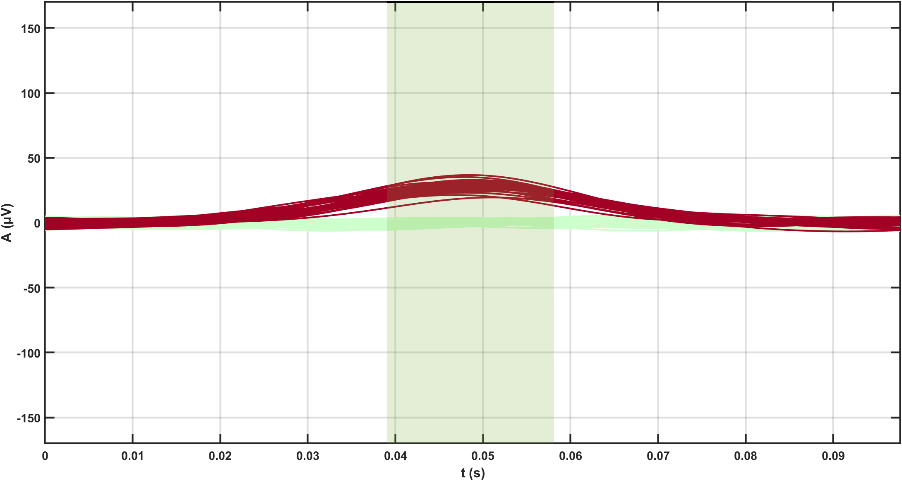

# Code for TWA Analysis with ECG Imaging

This repository contains MATLAB code for the analysis of T-wave alternans (TWA) using electrocardiographic imaging (ECGI).

It includes:
- Noise generation methods to make synthetic subjects more realistic.
- Developed low-pass and detrending filters to remove noise from ECG signals.
- Implementation of the Single Reference Segmentation (SRS) method, a T-wave segmentation technique specifically tailored for ECGI data.
- Implementation of a novel TWA detection method designed specifically for ECGI data. This method combines manifold learning, community detection, and bootstrap resampling techniques to enhance detection accuracy.
- Implementation of MC-WindowSHAP, an interpretability algorithm based on Shapley Additive Explanations (SHAP), adapted for use with time series data to improve the explainability of the novel TWA detection method.

## Table of Contents
1. [Overview](#overview)
2. [Features](#features)
3. [Requirements](#requirements)
4. [Installation](#installation)
5. [File Structure](#file-structure)
6. [Results](#results)
7. [License](#license)
8. [Contact](#contact)

## Overview

TWA consists of subtle variations in the morphology or amplitude of consecutive T-waves in electrocardiographic (ECG) studies. This index is associated with an increased risk of arrhythmias and sudden cardiac death. This project introduces a novel TWA detection algorithm tailored for use with ECGI data, a high resolution method for mapping the heart's electrical activity.

The code contains:
- **Noise addition**: Add baseline noise and high-frequency noise to clean ECG signals to make them more realistic.
- **Add synthetic alternans**: Add synthetic alternans to generate controlled cases.
- **Preprocessing**: Apply a detrending filter and a low-pass filter to clean ECG signals.
- **Segment T-waves**: Segment T-waves with the SRS method, which is specifically tailored to ECGI data.
- **TWA detection algorithm**: Novel TWA detection algorithm that employs:
	- **Manifold Learning**: Reduces the dimensionality of ECGI data while preserving its intrinsic geometry.
	- **Community Detection**: Clusters the reduced data to identify regions where TWA is likely present.
	- **Bootstrap Resampling**: Provides robust statistical confidence in the detection results.
- **MC-WindowSHAP interpretability algorithm**: A modified SHAP algorithm for time series data is used to interpret the detection outcomes, enabling users to understand the contributions of specific signal windows.

This method provides a powerful, interpretable tool for TWA detection in high-dimensional ECGI data, and the results are validated through various Bootstrap iterations.

## Features

- **T-wave Segmentation with the SRS method**: Segment T-waves by leveraging the synchronized functioning of the heart. This method is particularly efficient when applied to ECGI data.
- **Dimensionality Reduction with Uniform Manifold Approximation and Projection (UMAP)**: Projects high-dimensional ECGI data into a lower-dimensional space, preserving both the local and global structure of the original data.
- **Community Detection with the Louvain algorithm for TWA Identification**: Leverages graph-based clustering to detect regions of TWA.
- **Bootstrap Resampling**: Provides robust statistical validation of the detected patterns by generating confidence intervals around the results.
- **MC-WindowSHAP**: Adapts the SHAP framework for time series data, allowing users to interpret which parts of the ECG signals contribute most to TWA detection.
- **Fully Automated Workflow**: The method is designed to automatically process ECGI data and output the detected TWA regions and their interpretability.

## Requirements

To run this code, you will need the following software and toolboxes:

- **MATLAB R2022b or later**
- **UMAP** via MATLAB's `run_umap` function:
  - The UMAP package can be installed from [MATLAB File Exchange](https://www.mathworks.com/matlabcentral/fileexchange/71902-run_umap).
- **Louvain Algorithm**:
  - The Louvain algorithm is used for community detection in the manifold learning stage. It can be downloaded from the GenLouvain repository: [GenLouvain GitHub repository](https://github.com/GenLouvain/GenLouvain).

## Installation

To install and run the algorithm, follow these steps:

1. **Clone the repository** using Git. Open a terminal or command prompt and run the following command:
   ```bash
   git clone https://github.com/estelasc/TWA-analysis-toolbox.git
2. **Navigate to the cloned directory.**
   ```bash
   cd TWA-analysis-toolbox
3. **Open MATLAB**.
4. **Set the current folder to the location** where you downloaded the repository
5. **Add the repository to your MATLAB path**
   ```bash
   addpath(genpath('TWA-analysis-toolbox'))

## File Structure

The repository is organized as follows:

	```plaintext
	TWA-analysis-toolbox/
	├── main.m               			# The main script with an example to run the TWA detection algorithm     
	├── data/                      			# Directory containing synthetic data created from the [EDGAR repository](https://www.ecg-imaging.org/edgar-database)
	│   └── data.mat         			# ECGI epicardial data for testing and demonstration
	├── functions/                      		# Directory containing functions for generating synthetic subjects, filtering signals, and applying the TWA algorithm and MC-WindowSHAP
	│   └── add_BW.m 				# Function for adding baseline noise
	│   └── add_high_freq_noise.m 			# Function for adding high-frequency noise
	│   └── add_TWA.m 				# Function for adding synthetic alternans
	│   └── ApplyMC_WindowSHAP.m 			# Function for applying the customized interpretability algorithm
	│   └── bootstrapping.m 			# Function for applying Bootstrap resampling
	│   └── calculateCI.m 				# Function for calculating confidence intervals
	│   └── evaluateTWA.m 				# Function for taking a decision on the presence or absence of TWA
	│   └── low_pass_filter.m 			# Function for filtering high-frequency noise
	│   └── MnL_based_TWA_detection_algorithm.m 	# Function where the MnL-based TWA detection algorithm is applied
	│   └── spline_detrending_filter.m 		# Function for detrending the ECG signals
	│   └── SRS.m 					# Function for segmenting T-waves with the Single Reference Segmentation method
	├── figures/                      		# Directory containing figures with the code outputs
	│   └── SRS1.png         			# Figure with one beat segmented in one ECG signal
	│   └── SRS2.png         			# Figure with T-waves segmented in one ECG signal
	│   └── TWAsignals.png         		# Figure with alternan signals from different mesh points
	│   └── distribution.png         		# Boostrap derived distribution used to decide on the presence or absence of TWA
	│   └── embedded_space.png         		# Lower-dimensional space generated by UMAP with different communities extracted by the Louvain algorithm
	│   └── mesh.png         			# Epicardial mesh with the area with TWA highlighted 
	│   └── shap1.png         			# Shapley values for each latent space dimension
	│   └── shap2.png         			# Most important window for the projection or data points according to MC-WindowSHAP
	│   └── signals.png         			# Input signals from the community with TWA
	├── LICENSE                     		# License information for the Project
	└── README.md                  			# This README file


## Results

### 1. SRS Method Results

When the code is executed, the user will be prompted with a figure that requires manual segmentation of a single beat from an ECG signal. This is done through an interactive window, where the user can zoom in for precision and press any keyboard button to start the segmentation process.

- **Single Beat Segmentation**: 
  - The user will be asked to select the starting and ending points of a single beat.

	

  - Once selected, a new figure will appear, requesting the segmentation of T-waves.
  
- **T-wave Segmentation**:
  - The user will manually select the start and end points of the T-wave for a single ECG signal.

	

  - These manually selected points are then used to automatically segment T-waves in the remaining signals, taking into account the synchronous functioning of the human heart.

Once the T-waves are segmented, even and odd T-wave templates are created for each mesh point. For each mesh point, the corresponding even and odd templates are subtracted from one another to generate **alternan signals**, which serve as the input for the TWA detection algorithm.

	

### 2. TWA Detection Method Results

Once the TWA detection algorithm has been applied, the following results will be generated:

- **Latent Space Representation** and **Epicardial Mesh Visualization**:
  - A figure displaying the latent space, where the community with detected TWA is highlighted either in red (if our method detects TWA) or purple (if our method does not detect TWA), and the rest of the embedding is shown in green.
  - A 3D figure of the epicardial mesh is shown, with the area affected by TWA colored either in red (if our method detects TWA) or purple (if our method does not detect TWA). This visualization allows the user to see not only whether TWA is present, but also the specific region of the heart where it is located.

	<span>
  	  
	</span>
	<span>
  	  
	</span>

- **TWA Detection Confidence**:
  - A graph is generated displaying the confidence interval (in green) and the empirical value (in either red or purple), explaining the decision of the algorithm regarding whether the subject has TWA or not.
	
	

- **TWA Pattern Visualization**:
  - To enhance interpretability, the corresponding input signals (subtraction of even and odd T-waves) are shown for the community with TWA. This allows the user to observe the specific TWA pattern detected.

	

- **Explainability with Shapley Values**:
  - Shapley values are used to provide further explainability of the model's decision. The ECG signals are divided into 5 windows, and the importance of different latent dimensions is highlighted.

	

  - The signals from the most important window, which contributed the most to projecting the ECGI data into the latent space for the TWA community, are also displayed.

	


These visualizations provide not only detection but also insights into how and why the TWA was detected, enhancing both interpretability and explainability of the results.

## License

This project is licensed under the [Creative Commons Attribution 4.0 International License (CC BY 4.0)](https://creativecommons.org/licenses/by/4.0/). 

### Summary of the CC BY License

The CC BY license allows you to:

- Copy, distribute, and transmit the work.
- Adapt the work.
- Use the work in any way, as long as proper attribution is given to the original author.

### How to Cite

If you use this code in your research or find it helpful, please cite our papers, where this methods are explained:

**Estela Sánchez-Carballo, Francisco Manuel Melgarejo-Meseguer, José Luis Rojo-Álvarez, Arcadi García-Alberola and Yoram Rudy**, "Single Reference Segmentation to Estimate T-Wave Alternans", *2023 Computing in Cardiology (CinC), Atlanta, GA, USA*, pp. 1-4, 2023, doi: [10.22489/CinC.2023.018](https://doi.org/10.22489/CinC.2023.018).

**Estela Sánchez-Carballo, Francisco Manuel Melgarejo-Meseguer, Ramya Vijayakumar, Juan José Sánchez-Muñoz, Arcadi García-Alberola, Yoram Rudy and José Luis Rojo-Álvarez**, "Reference for Electrocardiographic Imaging-Based T-Wave Alternans Estimation", *IEEE Access*, vol. 12, pp. 118510-118524, 2024, doi: [10.1109/ACCESS.2024.3447114](https://doi.org/10.1109/ACCESS.2024.3447114).

**Estela Sánchez-Carballo, Francisco Manuel Melgarejo-Meseguer, Ramya Vijayakumar, Juan José Sánchez-Muñoz, Arcadi García-Alberola, Yoram Rudy and José Luis Rojo-Álvarez**, "Interpretable Manifold Learning for T-Wave Alternans Assessment with Electrocardiographic Imaging", *submitted*.

For further details on how to properly attribute this work, please refer to the [CC BY license summary](https://creativecommons.org/licenses/by/4.0/).

## Contact

For any questions, suggestions and comments feel free to reach out:

- **Estela Sánchez-Carballo**
  Department of Signal Theory and Communications, Telematics, and Computing, Universidad Rey Juan Carlos, Fuenlabrada, Madrid, Spain
  
  https://github.com/estelasc

  Email: estela.sanchezc@urjc.es

  LinkedIn: [Estela Sánchez-Carballo](www.linkedin.com/in/estela-sánchez-carballo-1151a821b)

You can also create an issue in this repository if you encounter any bugs or have suggestions for improvements.

Thank you for your interest in this project!